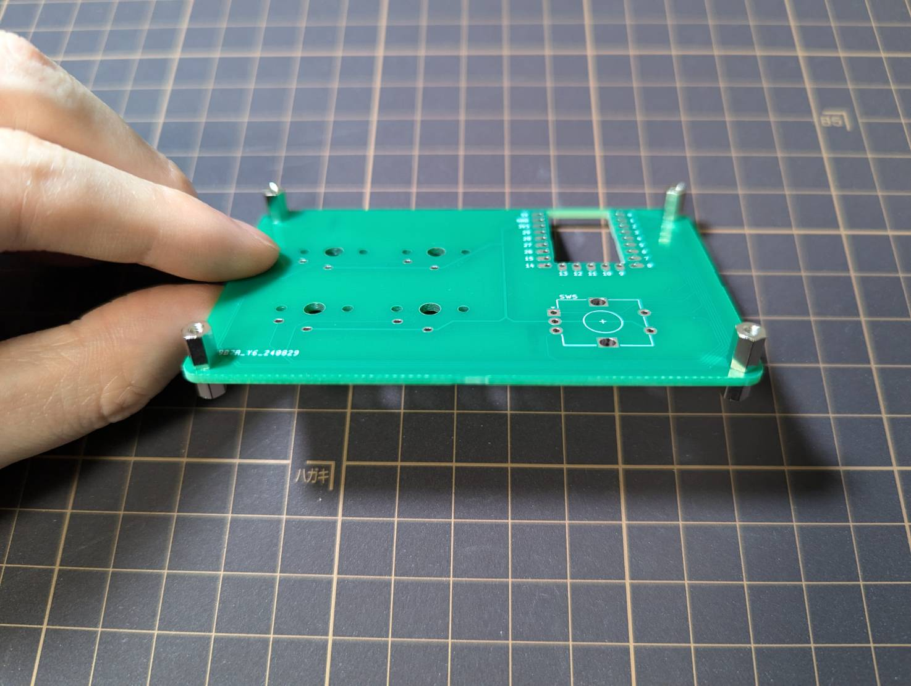
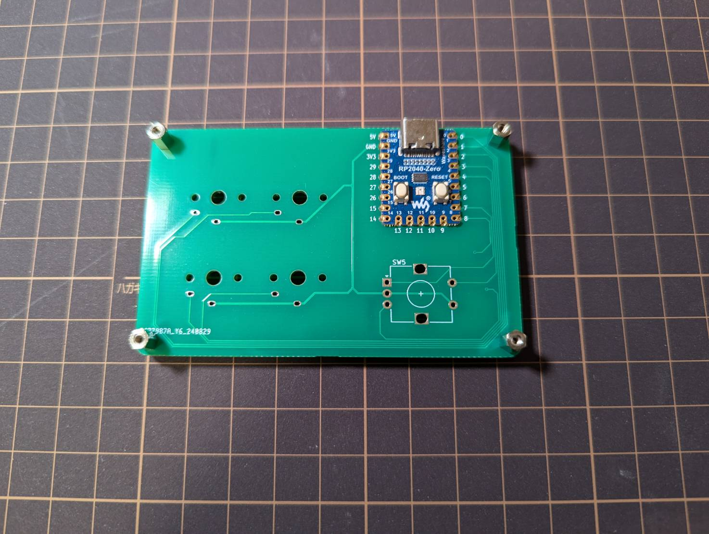
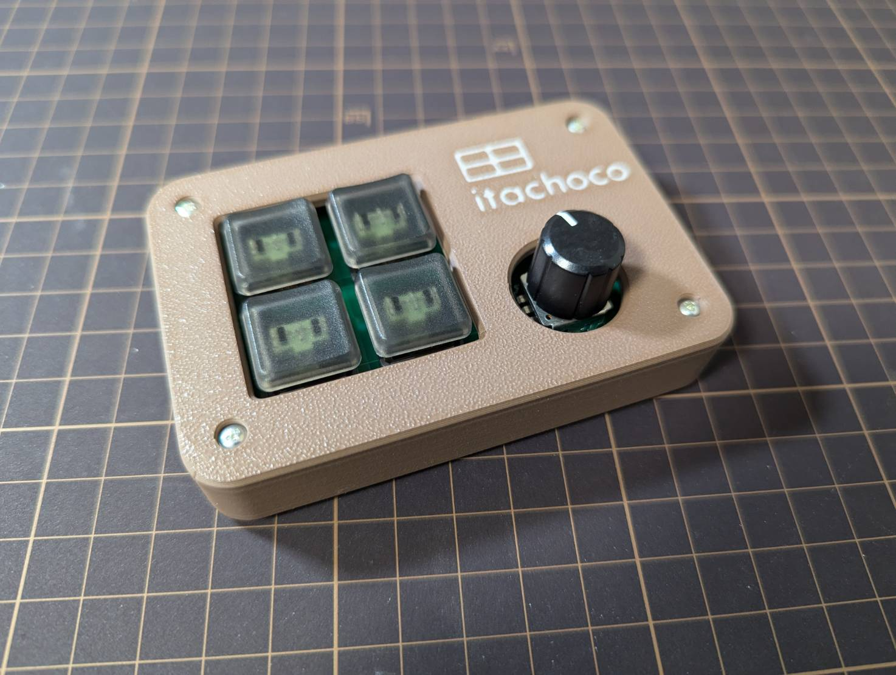

## はじめに

itachoco のキーボードを組み立てるためのビルドガイドです。
もし初期不良や組み立て方について質問があれば、[https://x.com/SangoKey_](https://x.com/SangoKey_) までお問い合わせください。

## 1. 内容物の確認

### 1-1. 内容物一覧
必ずすべての内容物が揃っているか確認してください。

| 品名 | 番号 | 数 | 備考 |
| --- | --- | --- | --- |
| 3Dプリントケース | ① | 1セット | ロットによって色やデザインが異なる場合があります |
| プリント基盤 | ② | 1 | ロットによって色やデザインが異なる場合があります |
| rp2040zero | ③ | 1 |  |
| M2ネジ | ④ | 8 |  |
| 黄銅スペーサー | ⑤ | 4 |  |
| 黄銅スペーサー（オスメス） | ⑥ | 4 |  |
| ゴム足 | ⑦ | 4 |  |

### 1-2. ⚠️ rp2040zero の動作確認
必ず組み立て前に実施してください

1. パソコンにrp2040zeroを接続
2. [REMAP](https://remap-keys.app/) へアクセス
3. `CUSTOMIZE YOUR KEYBOARD` をクリック

    

4. `+ KEYBOARD` をクリックし、ポップアップから `itachoco` を選択

    

5. 画像のように `itachoco` のキーマップが表示されればOK

    

### 1-3. ケースに大きなキズや歪みが無いか確認

## 2. 工具を用意する

| 品名 | 必須かどうか | おすすめ | 備考 |
| --- | --- | --- | --- |
| はんだごて | 必須 | goot PX-280 | 選ぶのが面倒な場合は、[遊舎工房の工具セット（入門セット）](https://shop.yushakobo.jp/products/a9900to?variant=49893653086439)でOK |
| はんだ | 必須 | はんだごて | 選ぶのが面倒な場合は、[遊舎工房の工具セット（入門セット）](https://shop.yushakobo.jp/products/a9900to?variant=49893653086439)でOK |
| はんだごて台 | 必須 | goot ST-27 | 選ぶのが面倒な場合は、[遊舎工房の工具セット（入門セット）](https://shop.yushakobo.jp/products/a9900to?variant=49893653086439)でOK |
| マスキングテープ | 必須 |  |  |
| (+)1 ドライバー | 必須 | vessel No.220(+1×100)  | 選ぶのが面倒な場合は、[遊舎工房の工具セット（追加セット）](https://shop.yushakobo.jp/products/a9900to?variant=49893653119207)でOK |
| 作業マット | 無くても可 |  | 机保護のため私はカッターマットを使っています |

## 3. はんだ付けと組み立て

### 3-1. rp2040zero

1. 黄銅スペーサーを基盤に組み付ける
表面実装する際の熱が直接机などに伝わらないように、あらかじめ黄銅スペーサーを基盤に組み付けておく

黄銅スペーサー（オスメス）を基盤の裏から差し込む

🔺`itachoco` のロゴがある方が表になります

黄銅スペーサーを装着する

すべて組付けた後の写真

2. rp2040zero をマスキングテープで固定します

3. rp2040zero をはんだ付けします

🔺最初に四隅をはんだ付けするとやりやすいです

### 3-2. スイッチ

1. スイッチを基盤に組み付けます
隙間が出来ないようにしっかりとはめこみます

2. スイッチをはんだ付けします

### 3-3. ロータリーエンコーダー

1. ロータリーエンコーダーを基盤に組み付けます

2. ロータリーエンコーダーをはんだ付けします

## 3-4. 組み立て

1. ボトムケースと基盤（スペーサー組付け済み）を M2ネジで固定します

2. トップケースを被せ、M2ネジで固定します

3. ゴム足を貼り付けます

4. 好みのキーキャップを装着します

## 最後に

